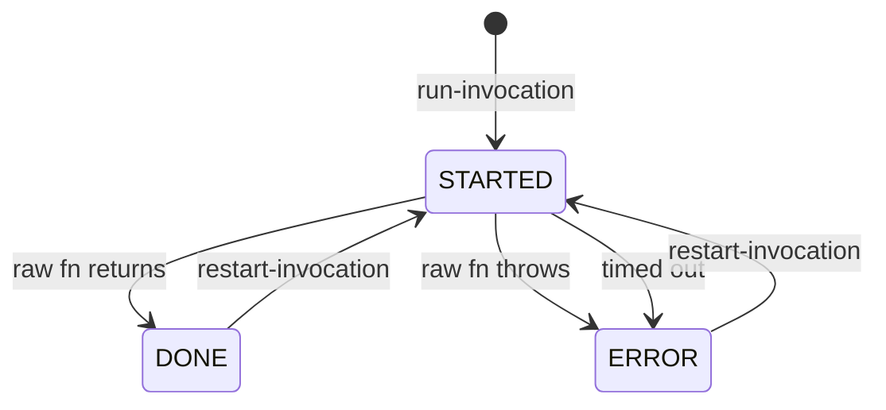

# tenon

A durable execution engine for Clojure functions on SQLite.

Every function invocation (and its result) is logged to a database table. The database is used for:

- Audit log of what happened.
- Idempotency based on function name and argument list.
- Retries on errors.
- Web UI is provided for browsing and managing.

## Usage

Mark `defn` forms with `#workflow` to have their invocations tracked.

```clojure
#workflow
(defn charge-card [customer-id idempotency-key amount]
  (payments/charge! customer-id amount)
  (email/send-charge-email customer-id amount)
  {:status :OK})
```

Every call to `charge-card` writes a database logs into the database. Marked functions can call other such functions and the whole call chain is tracked.

## Try it in the REPL

Start the REPL with `./run repl`.

```clojure
; Everything we may need
(require 'tenon.workflow 'tenon.workflow.server 'tenon.workflow.fixtures :reload-all)

; Start an engine
(def my-engine (tenon.workflow/init "/tmp/bbb"))

; Starting the API web server (only for testing here, jetty server is not part of the library.)
(tenon.workflow.server/start! my-engine {})

; Bind to a dynamic var so that following workflow invocations have context.
(alter-var-root #'tenon.workflow/*workflow-engine* (constantly my-engine))

; Call a recursive function that has been marked with #workflow
(tenon.workflow.fixtures/fibonacci 20)
```

You can find the invocations in the web UI started at http://localhost:3000.

## Metadata

Attach arbitrary caller-supplied data (for example, an actor id, span id, trace id, etc) to a workflow row by binding `*workflow-meta*` around a call:

```clojure
(require '[tenon.workflow :as wf])

(binding [wf/*workflow-meta* {:actor-id 42 :trace-id "abc"}]
  (charge-card customer-id amount))
```

## State transitions



## Build tooling

- `./run repl` - REPL with some helpers.
- `./run test` - run the test suite.
- `./run deps` - pre-download all dependencies.
- `./run clean` - remove build/cache artifacts.

## AI disclaimer

AI coding agents were used to help implementing parts of the library (after years of thinking about it)
and most of the test suite. AI contributions are fine as long as they are also thought through and
solve real problems.

## Licence

Copyright (c) Janos Erdos. All rights reserved. The use and distribution terms for this software are covered by the Eclipse Public License 2.0 (https://www.eclipse.org/legal/epl-2.0/) which can be found in the file LICENSE.txt at the root of this distribution. By using this software in any fashion, you are agreeing to be bound by the terms of this license. You must not remove this notice, or any other, from this software.